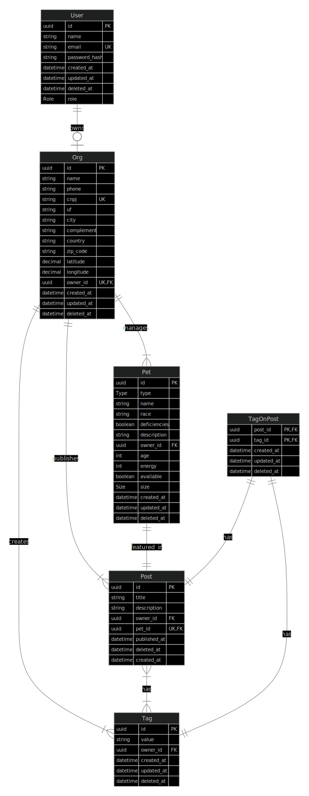

ER Diagram



# API

Find a Friend API

This project use the docker resources for Database.

So, if you want to run the docker with WSL2, first you need to start the service before than.
```sh
sudo service docker start
```

## RF

- [x] Should be able to register a user, pet, org and post
- [x] Should be able to signin
- [ ] Should be able to get the user or ORG's profile signed
- [x] Should be able to search by city for pets up for adoption
- [ ] Should be able to view details of a pet up for adoption
- [ ] Should be able to filter by characteristics pet

## RN

- [x] The user is not allowed to register with duplicated e-mail
- [ ] The user is not allowed to filter pets without input city
- [x] The ORG need address,
- [x] The Pet need to be linked to an ORG
- [ ] The user who wants to adopt will contact the ORG via WhatsApp
- [ ] All filters, besides the city, are optional
- [ ] For an ORG to access the application as admin, it must be logged in

## RNF

- [x] The user's password need be crypt
- [x] The aplication data need be persisted in the PostgreSQL database
- [ ] All the data list need to be paginate with 10 items per page
- [x] The user should be authenticated using JWT (JSON Web Token)
